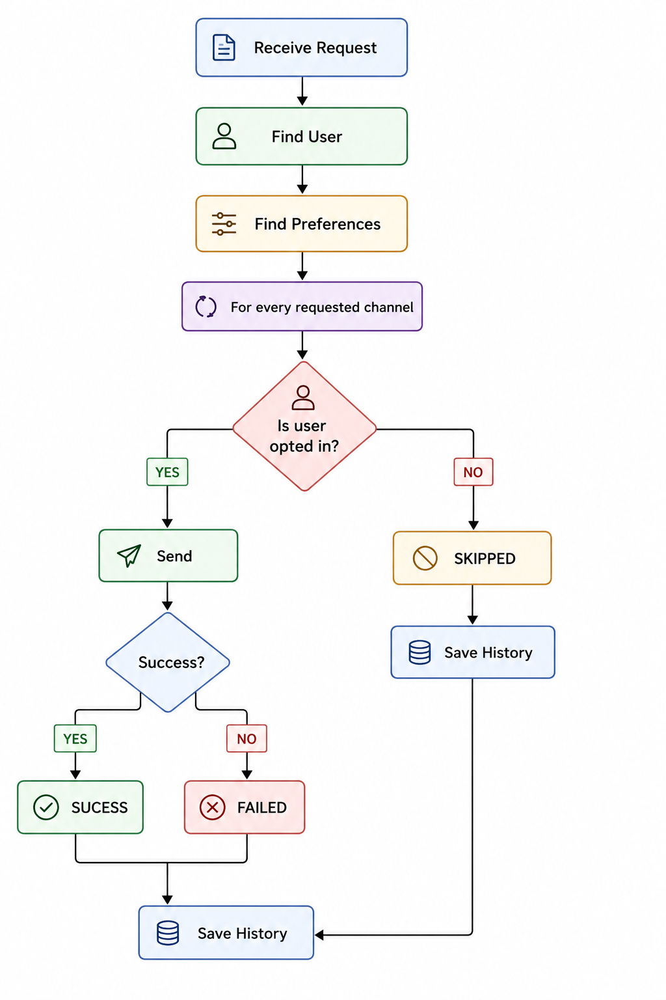

# Notification-System

A Spring Boot REST API for managing users, notification preferences, sending notifications through multiple channels, and maintaining notification delivery history.

The service supports four notification channels:

* **EMAIL**
* **SMS**
* **PUSH**
* **IN_APP**

The current notification providers are mock implementations that log the notification instead of connecting to real external services.

---

## Tech Stack

* Java 17
* Spring Boot 4
* Spring Web MVC
* Spring Data JPA
* Hibernate
* PostgreSQL
* Maven
* Lombok
* Jakarta Bean Validation
* JUnit / Spring Boot Test

---

## Project Structure

The project follows a layered architecture:

```text
src/
├── main/
│   ├── java/com/saksham/notification_service/
│   │
│   ├── config/
│   │   └── DataInitializer.java
│   │
│   ├── controller/
│   │   ├── NotificationController.java
│   │   ├── UserController.java
│   │   └── UserPreferenceController.java
│   │
│   ├── dto/
│   │   ├── NotificationHistoryResponse.java
│   │   ├── NotificationRequest.java
│   │   ├── NotificationResponse.java
│   │   ├── NotificationResult.java
│   │   ├── UpdateUserPreferenceRequest.java
│   │   ├── UserPreferenceResponse.java
│   │   ├── UserRequest.java
│   │   └── UserResponse.java
│   │
│   ├── entity/
│   │   ├── NotificationHistory.java
│   │   ├── User.java
│   │   └── UserPreference.java
│   │
│   ├── enums/
│   │   ├── DeliveryStatus.java
│   │   └── NotificationChannel.java
│   │
│   ├── exception/
│   │   ├── GlobalExceptionHandler.java
│   │   ├── UserNotFoundException.java
│   │   └── UserPreferenceNotFoundException.java
│   │
│   ├── provider/
│   │   ├── EmailNotificationProvider.java
│   │   ├── InAppNotificationProvider.java
│   │   ├── NotificationProvider.java
│   │   ├── PushNotificationProvider.java
│   │   └── SmsNotificationProvider.java
│   │
│   ├── repository/
│   │   ├── NotificationHistoryRepository.java
│   │   ├── UserPreferenceRepository.java
│   │   └── UserRepository.java
│   │
│   ├── service/
│   │   ├── NotificationHistoryService.java
│   │   ├── NotificationService.java
│   │   ├── UserPreferenceService.java
│   │   └── UserService.java
│   │
│   └── NotificationServiceApplication.java
│
├── main/resources/
│   └── application.properties
│
└── test/
    └── java/com/saksham/notification_service/
        ├── NotificationServiceApplicationTests.java
        └── service/
            └── NotificationServiceTest.java
```

---

## Architectural Approach

The application uses a **layered architecture** where each layer has a specific responsibility.

```text
Client / Postman
       │
       ▼
┌─────────────────┐
│   Controllers   │
│  REST Endpoints │
└────────┬────────┘
         │
         ▼
┌─────────────────┐
│    Services     │
│ Business Logic  │
└────────┬────────┘
         │
    ┌────┴─────┐
    ▼          ▼
Repositories  Providers
    │          │
    ▼          ▼
PostgreSQL   Notification
             Channels
```

### 1. Controller Layer

Controllers expose the REST API and handle HTTP requests.

Responsibilities:

* Receive API requests
* Validate request bodies
* Call the appropriate service
* Return HTTP responses

Example:

```text
POST /api/v1/notifications
```

is handled by `NotificationController`.

---

### 2. Service Layer

The service layer contains the application's business logic.

For example, `NotificationService`:

1. Finds the requested user.
2. Loads the user's notification preferences.
3. Processes every requested notification channel.
4. Checks whether the channel is enabled.
5. Selects the appropriate notification provider.
6. Dispatches the notification.
7. Records the delivery result in notification history.

This keeps business logic outside the controllers.

---

### 3. Repository Layer

Repositories use Spring Data JPA to communicate with PostgreSQL.

Main repositories:

* `UserRepository`
* `UserPreferenceRepository`
* `NotificationHistoryRepository`

The service layer uses these repositories instead of directly interacting with the database.

---

### 4. Provider Layer

The provider layer separates notification-channel-specific logic from the main notification service.

The common interface is:

```text
NotificationProvider
```

Implementations:

```text
EmailNotificationProvider
SmsNotificationProvider
PushNotificationProvider
InAppNotificationProvider
```

Each provider identifies its channel and handles channel-specific message formatting and dispatching.

The providers are currently **mock providers**. Instead of sending real messages, they write the notification details to the application logs.

This design makes it possible to replace a mock provider with a real email, SMS, or push notification integration later without changing the core notification service.

---

### 5. DTO Layer

DTOs are used to control the data entering and leaving the API.

Examples:

* `UserRequest`
* `UserResponse`
* `NotificationRequest`
* `NotificationResponse`
* `NotificationResult`
* `UpdateUserPreferenceRequest`
* `UserPreferenceResponse`

Validation is applied to incoming requests using Jakarta Bean Validation.

---

### 6. Entity Layer

The main database entities are:

```text
User
 │
 └── UserPreference

User
 │
 └── NotificationHistory
```

`NotificationHistory` stores the result of notification processing, including:

* User
* Channel
* Delivery status
* Notification title
* Error message, when applicable

---

### 7. Exception Handling

Application-specific exceptions are used for cases such as:

* User not found
* User preferences not found

`GlobalExceptionHandler` provides centralized handling of application errors so controllers do not need to contain repetitive exception-handling code.

---
### Business Logic

<p align="left">
  
</p>

---
## Notification Processing Flow

When a notification is requested:

```text
POST /api/v1/notifications
          │
          ▼
   NotificationController
          │
          ▼
    NotificationService
          │
          ├── Find User
          │
          ├── Find Preferences
          │
          └── Process Channels
                    │
          ┌─────────┼─────────┐
          ▼         ▼         ▼
        EMAIL      PUSH      IN_APP
          │         │         │
          ▼         ▼         ▼
       Provider  Provider  Provider
          │         │         │
          └─────────┼─────────┘
                    ▼
          Save Notification History
                    │
                    ▼
             Return Response
```

If a user has disabled a requested channel, that channel is marked as:

```text
SKIPPED
```

If the provider successfully processes the notification:

```text
SUCCESS
```

If processing fails:

```text
FAILED
```

---

# Local Setup

## Prerequisites

Install the following before running the project:

* Java 17+
* PostgreSQL
* Maven (optional because Maven Wrapper is included)
* Postman or another API client

Verify Java:

```bash
java -version
```

Verify PostgreSQL is running before starting the application.

---

## 1. Create the PostgreSQL Database

Create a database named:

```text
notification_db
```

Using PostgreSQL:

```sql
CREATE DATABASE notification_db;
```

The application currently uses:

```text
Host: localhost
Port: 5432
Database: notification_db
Username: postgres
```

Update the password in:

```text
src/main/resources/application.properties
```

Example:

```properties
spring.datasource.url=jdbc:postgresql://localhost:5432/notification_db
spring.datasource.username=postgres
spring.datasource.password=YOUR_POSTGRES_PASSWORD
```

---

## 2. Build the Project

Open a terminal in the project root.

### Windows

```bash
mvnw.cmd clean install
```

### Linux / macOS

```bash
./mvnw clean install
```

---

## 3. Run the Application

### Windows

```bash
mvnw.cmd spring-boot:run
```

### Linux / macOS

```bash
./mvnw spring-boot:run
```

The application starts on:

```text
http://localhost:8080
```

---

## 4. Development Test User

On startup, `DataInitializer` creates a development user automatically if it does not already exist.

The default test user is:

```text
Name: Test User
Email: test@example.com
Phone: 9876543210
Device Token: test-device-token
```

The default preferences are:

```text
EMAIL  → enabled
SMS    → disabled
PUSH   → enabled
IN_APP → enabled
```

The generated user's ID can be checked using the user API.

---

# API Endpoints

Base URL:

```text
http://localhost:8080/api/v1
```

## User APIs

### Create User

```http
POST /users
```

Example request:

```json
{
  "name": "John Doe",
  "email": "john@example.com",
  "phone": "9876543210",
  "deviceToken": "device-token-123"
}
```

---

### Get User

```http
GET /users/{userId}
```

Example:

```text
GET http://localhost:8080/api/v1/users/1
```

---

# User Preference APIs

### Get Preferences

```http
GET /users/{userId}/preferences
```

Example:

```text
GET http://localhost:8080/api/v1/users/1/preferences
```

---

### Update Preferences

```http
PUT /users/{userId}/preferences
```

Example:

```json
{
  "emailEnabled": true,
  "smsEnabled": true,
  "pushEnabled": false,
  "inAppEnabled": true
}
```

---

# Notification APIs

### Send Notification

```http
POST /notifications
```

Example:

```json
{
  "userId": 1,
  "title": "Order Update",
  "body": "Your order has been shipped.",
  "channels": [
    "EMAIL",
    "PUSH",
    "IN_APP"
  ]
}
```

The service processes every requested channel independently.

Example response:

```json
{
  "userId": 1,
  "results": [
    {
      "channel": "EMAIL",
      "status": "SUCCESS",
      "message": "Notification dispatched successfully"
    },
    {
      "channel": "PUSH",
      "status": "SUCCESS",
      "message": "Notification dispatched successfully"
    },
    {
      "channel": "IN_APP",
      "status": "SUCCESS",
      "message": "Notification dispatched successfully"
    }
  ]
}
```

If a channel is disabled in the user's preferences, the result will contain:

```json
{
  "channel": "SMS",
  "status": "SKIPPED",
  "message": "User has opted out of SMS notifications"
}
```

---

### Get Notification History

```http
GET /notifications/history/{userId}
```

Example:

```text
GET http://localhost:8080/api/v1/notifications/history/1
```

This returns the notification delivery history for the specified user.

---

# Testing with Postman

The easiest way to test the complete workflow is to use Postman.

## Step 1 — Start the Application

Run:

```bash
mvnw.cmd spring-boot:run
```

Confirm that the application is running on:

```text
http://localhost:8080
```

---

## Step 2 — Create a User

Create a `POST` request:

```text
http://localhost:8080/api/v1/users
```

Select:

```text
Body → raw → JSON
```

Use:

```json
{
  "name": "John Doe",
  "email": "john@example.com",
  "phone": "9876543210",
  "deviceToken": "device-token-123"
}
```

Save the returned `userId`.

---

## Step 3 — Check Preferences

Send:

```text
GET http://localhost:8080/api/v1/users/{userId}/preferences
```

This shows which notification channels are currently enabled.

---

## Step 4 — Update Preferences

Send:

```text
PUT http://localhost:8080/api/v1/users/{userId}/preferences
```

Body:

```json
{
  "emailEnabled": true,
  "smsEnabled": false,
  "pushEnabled": true,
  "inAppEnabled": true
}
```

---

## Step 5 — Send a Notification

Send:

```text
POST http://localhost:8080/api/v1/notifications
```

Body:

```json
{
  "userId": 1,
  "title": "Welcome",
  "body": "Welcome to the notification service.",
  "channels": [
    "EMAIL",
    "SMS",
    "PUSH",
    "IN_APP"
  ]
}
```

Because SMS is disabled in the example preferences, the response should contain:

```text
EMAIL  → SUCCESS
SMS    → SKIPPED
PUSH   → SUCCESS
IN_APP → SUCCESS
```

---

## Step 6 — Check Notification History

Send:

```text
GET http://localhost:8080/api/v1/notifications/history/1
```

The history should contain the notification attempts and their delivery statuses.

---

# Running Tests

The project contains unit and Spring Boot tests.

Run all tests using Maven Wrapper.

### Windows

```bash
mvnw.cmd test
```

### Linux / macOS

```bash
./mvnw test
```

To build and run tests together:

```bash
mvnw.cmd clean install
```

---

# Important Design Decisions

### Channel-based Provider Design

The `NotificationProvider` interface allows each notification channel to have its own implementation.

This avoids putting channel-specific logic directly inside `NotificationService`.

Adding another channel in the future can follow the same pattern:

```text
NotificationProvider
       │
       ├── EmailNotificationProvider
       ├── SmsNotificationProvider
       ├── PushNotificationProvider
       ├── InAppNotificationProvider
       └── NewNotificationProvider
```

---

### User Preference Check

Before dispatching a notification, the service checks whether the user has enabled the requested channel.

This prevents notifications from being sent through channels that the user has opted out of.

---

### Notification History

Every notification attempt is recorded as:

```text
SUCCESS
FAILED
SKIPPED
```

This provides an audit trail and makes it possible to inspect notification delivery behavior.

---

### Mock Providers

The current providers simulate delivery by writing messages to the application logs.

For example:

```text
Mock EMAIL sent to john@example.com
Mock SMS sent to 9876543210
Mock PUSH notification sent to device-token-123
Mock IN_APP notification created for user 1
```

These providers can later be replaced with real integrations without changing the overall service architecture.

---

# Documentation

Architecture diagrams are available under:

```text
docs/
├── class-diagram.mermaid
└── er-diagram.mermaid
```

The diagrams provide a visual representation of the application's classes and database relationships.

---

# Summary

The project follows a clean layered architecture:

```text
Controller
    ↓
Service
    ↓
Repository ───→ PostgreSQL
    ↓
Provider
    ↓
Notification Channel
```

The main workflow is:

```text
Create User
     ↓
Configure Preferences
     ↓
Send Notification
     ↓
Check Channel Preferences
     ↓
Dispatch Through Provider
     ↓
Record Delivery Status
     ↓
View Notification History
```

The architecture is intentionally modular so that notification providers can be replaced or extended without significantly changing the core business logic.

## Scalability Considerations

- **Provider abstraction** — allows notification channels to be scaled or replaced independently.
- **Async processing** — Kafka can be introduced for high-volume notifications.
- **Database optimization** — indexing, pagination, and connection pooling can handle growing data.
- **Caching** — Redis can reduce repeated database lookups.

## Future Improvements

- Integrate real **Email, SMS, Push, and In-App providers**
- Add **Kafka** for asynchronous notification processing
- Add **Redis caching**
- Add **JWT authentication & authorization**
- Add **Docker + CI/CD**
- Add **monitoring and observability**

## Documentation

📄 **[Product Development Roadmap](https://docs.google.com/document/d/10To1D78Ue7th_UlRmdbiXIeC_h11B3I7ghdiTRvcTfM/edit?usp=sharing)**  
Detailed walkthrough of the project's development from scratch, including architecture, implementation phases, testing, and future improvements.