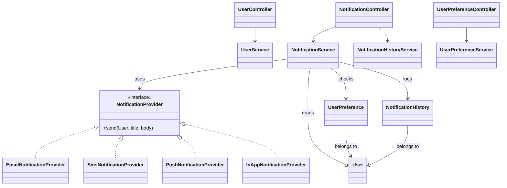

# Class Diagram

```mermaid
classDiagram
    class NotificationController
    class UserController
    class UserPreferenceController

    class NotificationService
    class UserService
    class UserPreferenceService
    class NotificationHistoryService

    class NotificationProvider {
        <<interface>>
        +send(User, title, body)
    }
    class EmailNotificationProvider
    class SmsNotificationProvider
    class PushNotificationProvider
    class InAppNotificationProvider

    class User
    class UserPreference
    class NotificationHistory

    NotificationController --> NotificationService
    NotificationController --> NotificationHistoryService
    UserController --> UserService
    UserPreferenceController --> UserPreferenceService

    NotificationService --> NotificationProvider : uses
    NotificationProvider <|.. EmailNotificationProvider
    NotificationProvider <|.. SmsNotificationProvider
    NotificationProvider <|.. PushNotificationProvider
    NotificationProvider <|.. InAppNotificationProvider

    NotificationService --> User : reads
    NotificationService --> UserPreference : checks
    NotificationService --> NotificationHistory : logs

    UserPreference --> User : belongs to
    NotificationHistory --> User : belongs to
```
